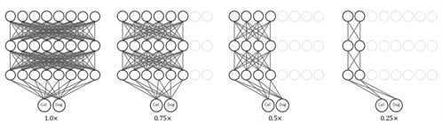
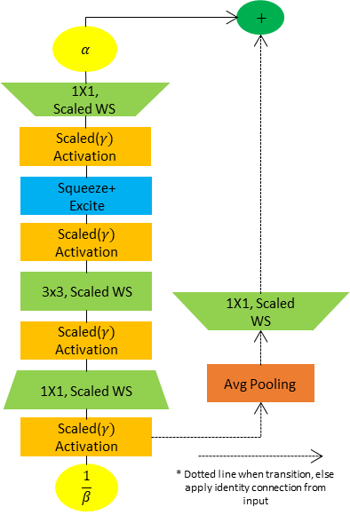
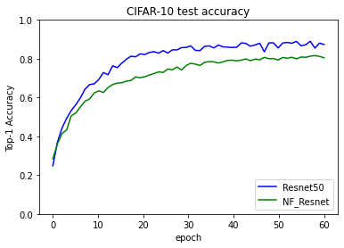
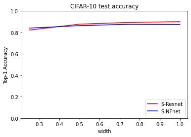
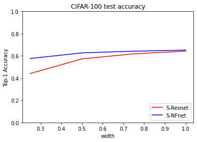
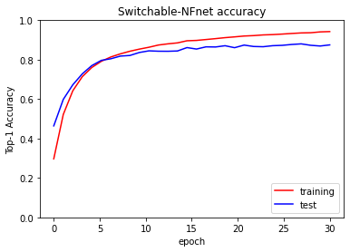
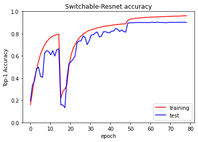

# Switchable-Normalizer-free-network
Graduation project in SNU-ECE/2021-1 

## slimmable neural network
------
**Sturcture**
-  Implementation of a width switchable structure at the inference time
- Adapt ‘width-multiplier’(1.0x, 0.75x, 0.5x, 0.25x) as a metric to change channel length
- Contain an extra layers for Batch-Normalization statistics(𝛾, 𝛽, (𝜇,) ̃  𝜎 ̃) separately among width varieties
  
    

    
    

**training**
-  Train among width varieties each as a sub-network
-  Update parameters using an average of gradients among widths
-  Use same training scheme throughout this work

    *image and training scheme from [this paper](https://arxiv.org/abs/1812.08928)

## Normalizer-Free Network
------
- Instead of using any form of normalization to activations, implement scaled Weight Standardization and  scaling(𝛼,  1/𝛽, 𝛾) factors

- Scaled Weight Standardization in every Convolution layer to prevent mean-shift

- 𝜶,   𝟏/𝜷    applied to input and output of the Block to control the variance as data propagates through the network

- Squeeze and Excite block to reduce signal magnitude by a factor of 0.5

- Adopt Dropout during training to reduce certain unit dependency 
  
    

    
    

    *refer to [this paper](https://arxiv.org/abs/2101.08692).

## Results
------
1. Comparison between ResNet50 and NFnet(NF-Regnet-50)
   
 

2. Comparison between slimmable ResNet50 and slimmable NFnet
   
 
 

3. Convergence test
 
 
 

## References
------
Papers directly used in this work

1. Slimmable Neural Networks, ICLR 2019(Yu et al.) [link](https://arxiv.org/abs/1812.08928)
2. Characterizing Signal Propagation to close the performance gap in unnormalized ResNets, ICLR 2021(Brock et al.) [link](https://arxiv.org/abs/2101.08692)
3. Deep Residual Learning for Image Recognition, CVPR 2015 (He et al.) [link](https://arxiv.org/abs/1512.03385)
4. High-performance large-scale image recognition without normalization, 2021(Brock et al.) [link](https://arxiv.org/abs/2102.06171)
5. Universally slimmable networks and improved training techniques, IEEE/CvF 2019(Yu et al.) [link](https://arxiv.org/abs/1903.05134)

## Others
------
CIFAR-10/100 are the most simple datasets to be tested, and other datasets are required to verify the model scheme suggested on this work(excluded ImageNet due to resource limiatations, but also applicable). Tried on Tiny-Imagenet but more works are needed for a satisfiable result.

- Tiny-ImageNet
  <pre><code>  !wget http://cs231n.stanford.edu/tiny-imagenet-200.zip
    !unzip tiny-imagenet-200.zip
  </code></pre>
  
